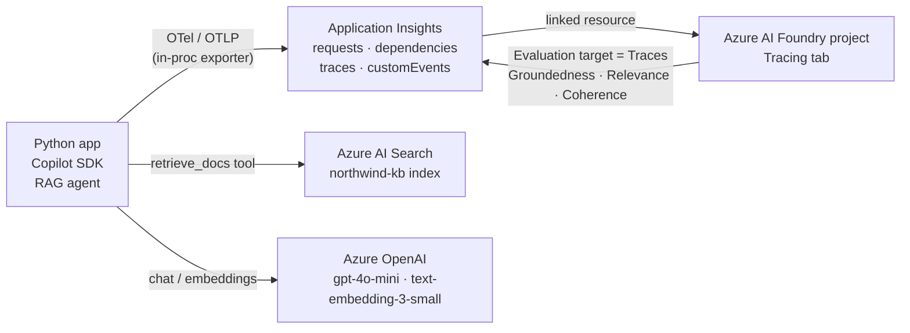

# Copilot SDK → OpenTelemetry → Azure Monitor → Foundry Tracing & Evaluation

A small, runnable end-to-end demo that proves the loop:

> **GitHub Copilot SDK** (Python RAG agent over FSI dummy data) → **OTel traces** → **Azure Monitor / Application Insights** → **Azure AI Foundry Tracing tab** → **Foundry evaluation** runs against those traces (Groundedness / Relevance / Coherence).

The whole demo is designed to be talked through in ~10–15 minutes.

> ⚠️ **Disclaimer — dummy data.** The "Northwind Bank" knowledge base in [`data/`](data/) is entirely fictional. Interest rates, fees, policies, and figures are made up for demonstration purposes only. **Not financial advice. Not affiliated with any real institution.**

---

## What this demo shows

1. The Copilot SDK has built-in OpenTelemetry support — you configure it once with `TelemetryConfig` and it emits spans for **agent runs, LLM calls, and tool execution** following the [OpenTelemetry GenAI semantic conventions](https://opentelemetry.io/docs/specs/semconv/gen-ai/).
2. With `azure-monitor-opentelemetry`, those spans flow straight into **Application Insights** as `dependencies` / `requests` / `traces` rows.
3. Because the App Insights resource is **linked to an Azure AI Foundry project**, the Foundry **Tracing** tab renders the spans as an interactive tree — no second pipeline.
4. Foundry's **Evaluation** feature supports `Target = Traces`. It pulls real production interactions out of App Insights and scores them with built-in evaluators (Groundedness, Relevance, Coherence, …). Results are written back into App Insights as `customEvents` named `gen_ai.evaluation.result`.

**Net result:** observability becomes measurable quality.

## Architecture



## Prerequisites

- An Azure subscription with quota for `gpt-4o-mini` and `text-embedding-3-small` in `eastus2`
  (fallback: `swedencentral`).
- [Azure Developer CLI](https://learn.microsoft.com/azure/developer/azure-developer-cli/install-azd) (`azd`) ≥ 1.10.
- [Azure CLI](https://learn.microsoft.com/cli/azure/install-azure-cli) (`az`) ≥ 2.60.
- Python ≥ 3.11.
- **Owner**, or **Contributor + User Access Administrator**, on the subscription
  (needed for the RBAC role assignments in [`infra/modules/rbac.bicep`](infra/modules/rbac.bicep)).

## Quickstart

```bash
# 1. Sign in and pick the right subscription
azd auth login
az login
az account set --subscription 51eb709f-8958-49c4-a547-ebdbd4bf66dc

# 2. Provision all Azure resources
azd env new copilot-otel-demo
azd env set AZURE_SUBSCRIPTION_ID 51eb709f-8958-49c4-a547-ebdbd4bf66dc
azd env set AZURE_LOCATION eastus2
azd up

# 3. Export environment for the Python app and seed the search index
azd env get-values > .env
python -m venv .venv && . .venv/Scripts/Activate.ps1
pip install -r app/requirements.txt
python app/seed_index.py

# 4. Run the demo (5 scripted prompts)
python app/app.py

# 5. (Optional) Tear everything down after the demo
azd down --purge
```

## Demo prompts

Defined in [`app/prompts.json`](app/prompts.json). Designed so each Foundry evaluator has a clear story:

| # | Prompt | Expected behaviour |
| --- | --- | --- |
| 1 | "What's Northwind Bank's minimum income requirement for a personal loan?" | Grounded — Relevance & Groundedness should be high |
| 2 | "How long do I have to dispute a credit card transaction at Northwind?" | Grounded |
| 3 | "What's the current 12-month term deposit rate at Northwind?" | Grounded |
| 4 | "Compare Northwind's high-interest saver and term deposits — which is better for an emergency fund?" | Partial — forces synthesis across two docs |
| 5 | "What was Northwind Bank's 2027 Q3 profit?" | **Ungrounded** — Groundedness should fail this row (the demo punchline) |

## Cost note

While running:

- **Azure AI Search Basic** ≈ AUD 3 / day (dominant cost — billed continuously)
- **Azure OpenAI** — pay-per-token, negligible for this demo (cents)
- **Application Insights / Log Analytics** — pay-per-GB ingested, also negligible
- **Foundry account + project** — no marginal cost for the demo workload

Total expected: **~AUD 3–6 / day**. Tear down with `azd down --purge` when you're done.

## References

- [GitHub Copilot SDK — OpenTelemetry observability](https://docs.github.com/en/copilot/how-tos/copilot-sdk/observability/opentelemetry)
- [OpenTelemetry GenAI semantic conventions](https://opentelemetry.io/docs/specs/semconv/gen-ai/)
- [Azure Monitor OpenTelemetry distro for Python](https://learn.microsoft.com/azure/azure-monitor/app/opentelemetry-enable?tabs=python)
- [Azure AI Foundry — evaluate from traces](https://learn.microsoft.com/azure/ai-foundry/how-to/develop/evaluate-sdk)
- [`microsoft/skills` — foundry-agent KQL templates](https://github.com/microsoft/skills/blob/main/.github/plugins/azure-skills/skills/microsoft-foundry/foundry-agent/trace/references/kql-templates.md)

## License

[MIT](LICENSE).
